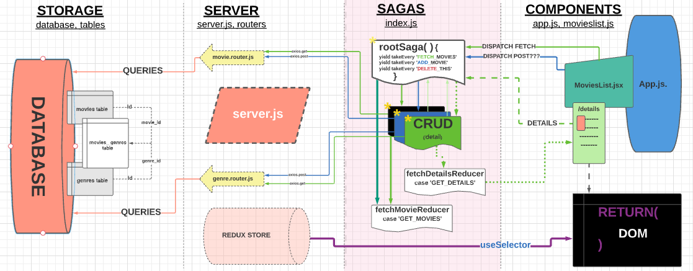
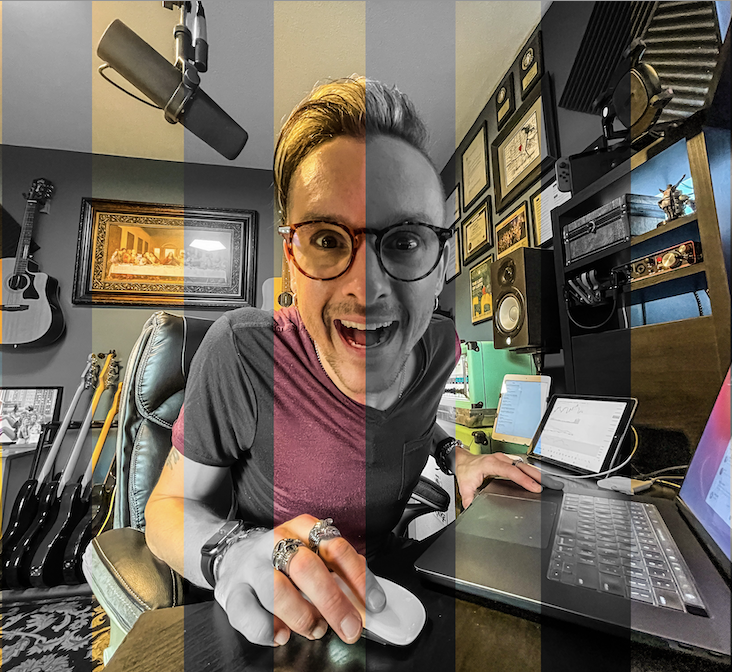

 # 
 <b>Weekend Movie Sagas 🎥 </b> 

## <b>This is a first functional draft of our weekend Movie Sagas assignment (pre-styling) .</b>
 

---

#### _Duration: Two-Day Sprint_ 

Do you like movies? Me too! Here's an app full of fun factoids for a few flicks...and you can even add you own. 

---
 

### _--demo gif coming soon!--_

---

_This chart represents the initial, conceptual flow of the app pre-design. Client to database moves right to left. [Lucid Chart](www.lucidchart.com) rocks, by the way._

---
---

 

## Prerequisites
---
- Internet browser application (e.g. Chrome, Safari)
   

## Installation
---
- Create a database using the provided .sql file called <b> "saga_movies_weekend" </b>and run the included queries.
- Run `npm install` from the project root directory.
- Run `npm run server` to run the node server.
- In a separate terminal tab, run `npm run client` to launch .the React app

 

## Usage

---
##### _please note that the following steps are in no particular order

1. View the list of movies via their posters on the home page.
2. Click on any movie's title or poster to open a details page.
3. On the details page, you can click "Go Back" to navigate back to the list page.
4. At any time, you can press the `Add Movie` button to open the `Add Movie` form page
5. Enter information for your movie including a poster image URL. All fields are required
  

## Built with
---
### [Visual Studio Code](https://code.visualstudio.com/), [Pixelmator Pro](https://www.pixelmator.com/pro/)
 

## License
---
N/A

 

## Acknowledgement
---
Thanks to my instructors and everyone at [Prime Digital Academy](www.primeacademy.io) for giving me the tools to do some really rad stuff. 

##### _Honorable mention - my lovely fiancée [Sharesa Golish](https://www.instagram.com/sharesadoeshair/) for the patience, support, creative opinions...and haircut._  

## Support
---
If you have questions or issues, please do not hesitate to email me at: [cmochinski@gmail.com](mailto:cmochinski@gmail.com). I'd love to hear from you!

---
 

_[My Twitter (@HolyMosesMusic)](https://twitter.com/holymosesmusic)_  
_[My GitHub](https://github.com/chrismochinski)_  
_[My LinkedIn](https://www.linkedin.com/in/chrismochinski/)_ 
